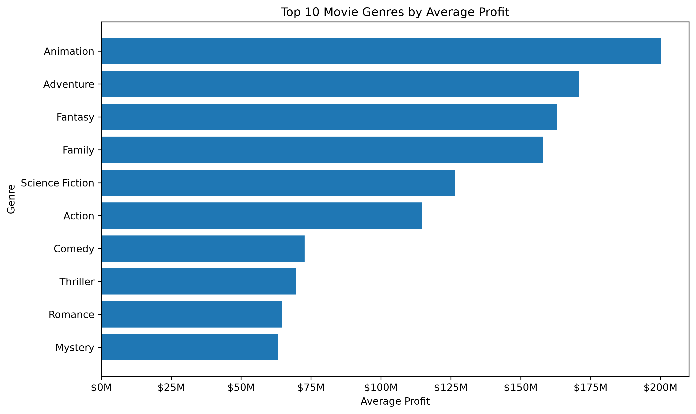
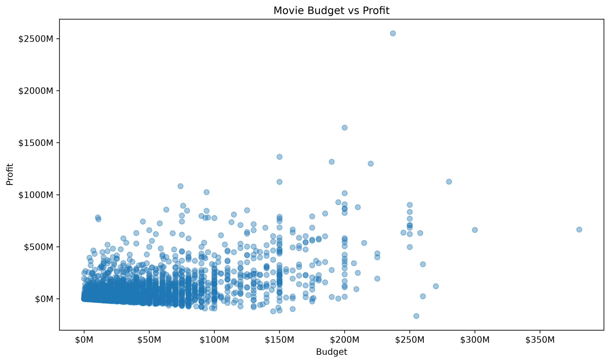
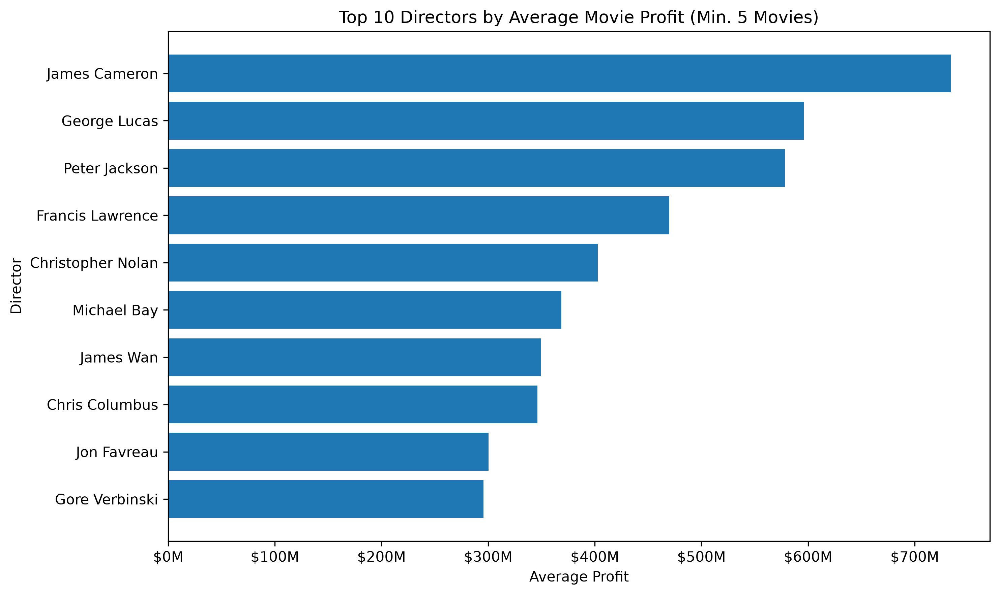
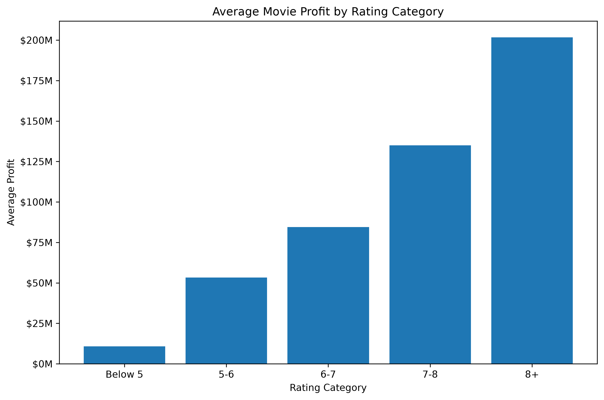
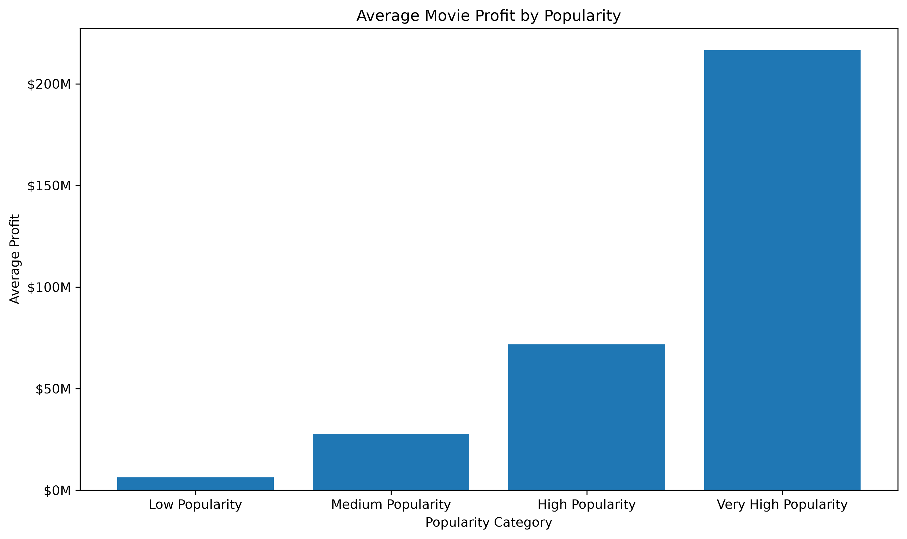
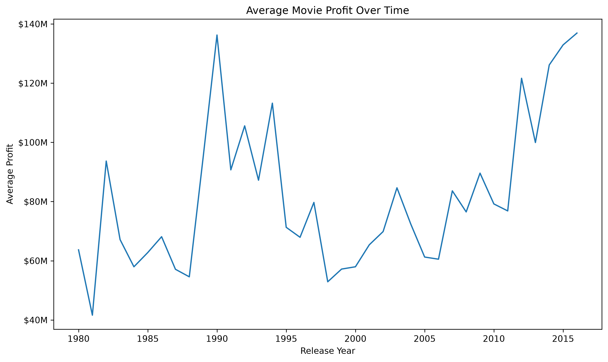

# 🎬 Movie Performance & Success Analysis

## Project Overview

What makes a movie successful?

In this project, I analyzed the TMDB 5000 Movie Dataset to explore the factors associated with movie performance from both a financial and audience perspective.

Instead of looking only at revenue, I focused on multiple measures of success including profit, return on investment (ROI), audience ratings, and popularity. I also explored how factors such as genre, budget, director, and cast relate to movie performance.

The analysis was completed using Python for data cleaning, exploration, and visualization, and SQL for structured business analysis.

## Tools & Technologies

- **Python** — Pandas, Matplotlib
- **SQL** — SQLite
- **Jupyter Notebook** — Data cleaning, exploration, and analysis
- **VS Code** — Development environment
- **Git & GitHub** — Version control and project publishing

## Dataset

This project uses the TMDB 5000 Movie Dataset, which contains information about approximately 4,800 movies, including:

- Budget and revenue
- Genres
- Audience ratings and popularity
- Release dates
- Cast and crew information

The original movie and credits datasets were cleaned, transformed, and merged in Python before being used for analysis.

## Business Questions

The project aims to answer the following questions:

- Which movie genres generate the highest average profit?
- Does a larger production budget lead to higher profitability?
- Which directors consistently deliver strong financial performance?
- Are higher audience ratings associated with higher profits?
- How does movie popularity relate to financial success?
- How has movie profitability changed over time?

## Analysis Workflow

The project followed a structured data analysis process:

1. Explored the raw TMDB movies and credits datasets
2. Cleaned missing and invalid values
3. Extracted genres, directors, and leading cast members
4. Merged the movie and credits datasets
5. Created financial metrics including profit and ROI
6. Used SQL to analyze genres, directors, ratings, budgets, popularity, and performance over time
7. Created visualizations in Python to communicate the main findings
8. Interpreted the results from a movie studio decision-making perspective

## Key Findings

### 🎭 Genre Performance

Animation, Adventure, Fantasy, and Family were among the most profitable genres in the dataset.

- **Animation** generated approximately **$198M average profit**
- **Adventure** generated approximately **$171M**
- **Fantasy** generated approximately **$163M**
- **Family** generated approximately **$158M**



### 💰 Budget vs Profit

Higher production budgets were generally associated with higher absolute profits. However, the relationship showed considerable variation, meaning that a large budget alone did not guarantee financial success.



### 🎬 Director Performance

To avoid ranking directors based on one successful movie, I limited the comparison to directors with at least **5 movies** with valid financial data.

Among these directors:

- **James Cameron** had the highest average profit at approximately **$734M**
- **George Lucas** followed at approximately **$596M**
- **Peter Jackson** averaged approximately **$578M**



### ⭐ Ratings and Profitability

Movies with stronger audience ratings tended to generate higher average profits.

Movies rated **8+** generated approximately **$200M in average profit**, while movies with ratings below 5 generated substantially lower profits.



### 📈 Popularity and Profitability

Popularity showed one of the clearest relationships with financial performance.

Movies in the **Very High Popularity** group generated approximately **$216M in average profit**, compared with approximately **$6M** for movies in the Low Popularity group.



### 📅 Profitability Over Time

Average movie profit generally increased over the analyzed period, although profitability varied considerably from year to year.


## Conclusion

This project shows that movie success cannot be explained by a single factor.

Genre, audience reception, popularity, budget, and the track record of directors all showed meaningful relationships with financial performance. Higher budgets were associated with larger profits overall, but the variation between movies suggests that spending more does not automatically lead to success.

The analysis also highlighted the importance of interpreting ROI carefully. Movies with very small budgets can produce extremely high ROI percentages, so ROI should be considered alongside absolute profit and revenue.

Overall, the results suggest that movie studios can make better decisions by evaluating several performance indicators together rather than relying on a single metric.

> **Note:** The findings describe associations within the TMDB 5000 dataset and should not be interpreted as causal relationships.

## Repository Structure

```text
Movie-Performance-Analysis/
├── data/          # Raw and cleaned datasets
├── notebooks/     # Python analysis
├── sql/           # SQL queries
├── visuals/       # Analysis charts
├── .gitignore
└── README.md
```